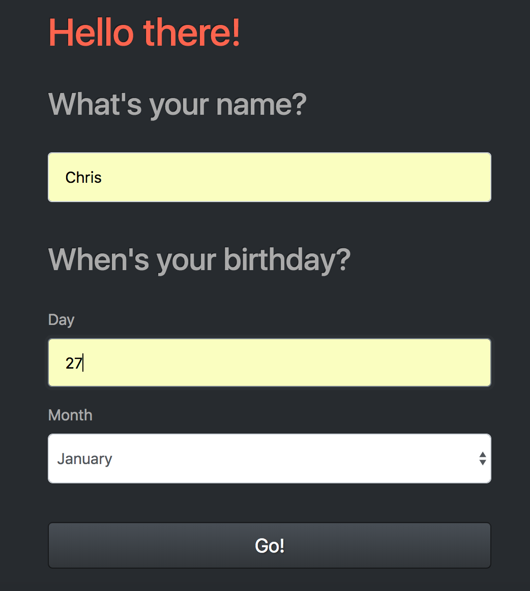
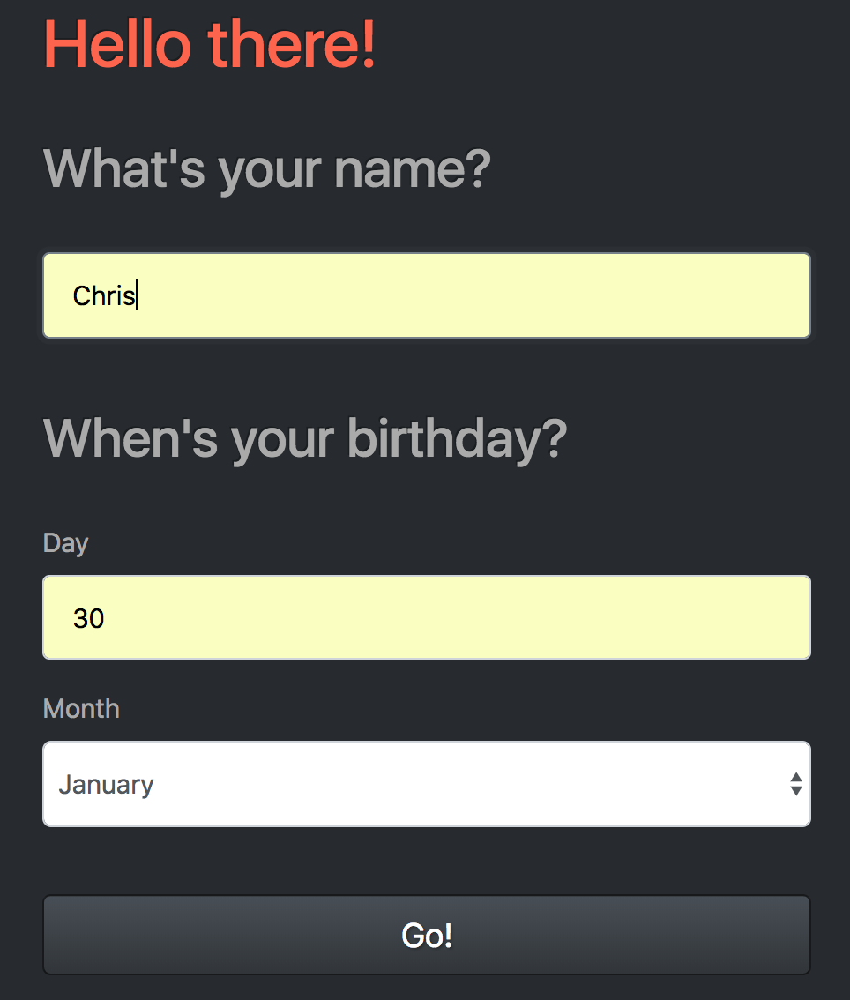

# Birthday App #

----

Little application which displays birthday wishes. If today is not a birthday day it will calculate a number of days left.

I have used the following tools and technologies:

- Ruby / Sinatra
- HTML / CSS
- Bootswatch
- RSpec and Capybara for testing
----
In order to test this application please clone or download this repository and run `rackup -p 4567`
from your terminal.

`git clone https://github.com/KrzysztofBalejko/birthday_app.git`

----
Please see below screenshots:

1. Simple form that takes necessary details

2. If today was a birthday day, wishes are displayed

3. This time form takes a future birthday date

4. As it is not today, remaining days are displayed

